# InSite

**An iOS app, personal pattern engine, and physiological digital twin for type 1 diabetes.**

I built InSite to bring glucose, insulin, sleep, activity, cycle history, and daily logs into one place. The research focuses on two questions: which combinations of recorded context accompany recurring glucose outcomes, and how well can a personal physiological model reproduce those responses?

The iOS app is in a small TestFlight pilot. Pattern cards are being evaluated using synthetic histories and remain disabled for participants. This repository contains the research implementation, reproducible examples, evaluation methods, and app screenshots.

My longer-term goal is personalized automated insulin delivery (AID): learn a state that preserves the consequences of insulin decisions, then use it to plan across their delayed effects. The app, pattern engine, and physiological twin provide the data, interpretable observations, and simulation tools for that research.

## The app

Home brings together mood logging, infusion-site tracking, therapy profiles, and sync status. Community includes a message board and a daily mini crossword with community-submitted clues. My Data organizes recorded streams into summaries and browsable charts.

| Home | Community | My Data |
| --- | --- | --- |
| 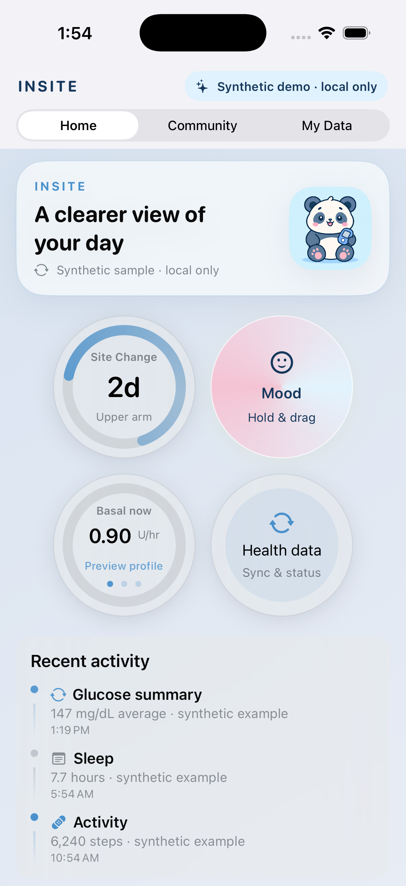 | 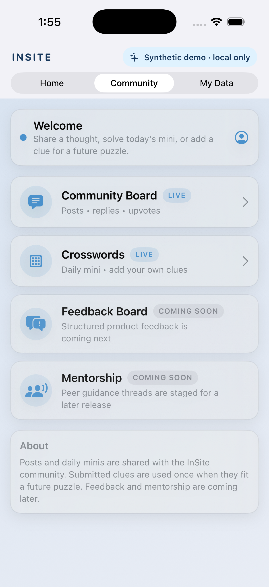 | 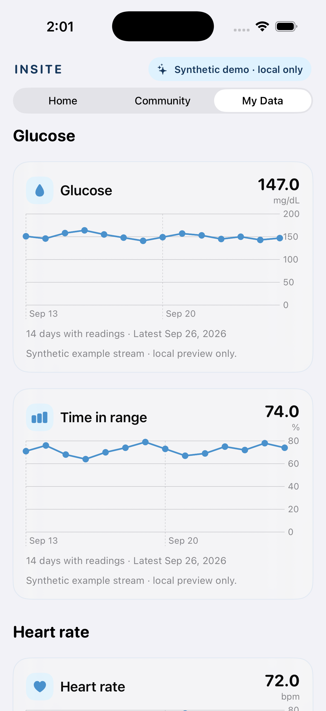 |

Simulator captures use local synthetic fixtures. [Screenshot provenance](docs/app-and-privacy.md).

## Explore the project

| Component | What you can inspect or run |
| --- | --- |
| **iOS app** | Home, community, health-data views, and observations with linked supporting days |
| **Pattern engine** | Time-aligned features, subgroup search, similar-context retrieval, and evidence checks; quick and full synthetic runs |
| **Digital twin** | Physiological and context parameters, fitting, held-out replay, and an interactive simulation |
| **Evaluation** | Held-out comparisons with T1DSim_AI and ReplayBG, numerical agreement with simglucose, and synthetic calibration |

## Digital twin

The twin combines a differentiable glucose–insulin model with personal parameters and recorded context. Fitting estimates insulin sensitivity, glucose production, insulin absorption and action timing, carbohydrate absorption, and context effects.

The model represents:

- **Exercise:** glucose uptake during activity and changes in sensitivity afterward.
- **Sleep:** duration-dependent sensitivity and glucose-production effects.
- **Cycle context:** recorded cycle-day effects or an inferred periodic sensitivity term.
- **Infusion sites:** a site-age sensitivity coefficient.
- **Stress and time of day:** sensitivity, glucose production, dawn, and circadian effects.
- **Variation in the records:** meal quantity and timing uncertainty, daily drift, response corrections, and residual disturbance.

[Model capabilities and assumptions](docs/twin-capabilities.md) · [Fitting and evaluation](docs/digital-twin.md) · [Source](twin/t1d_twin/model.py)

### Comparison with other digital twins

The existing benchmark compares the fitted twin with **T1DSim_AI** on HUPA-UCM and T1D-UOM, and with **ReplayBG** on HUPA-UCM. Both comparisons use held-out five-hour windows with recorded meals and insulin supplied during replay.

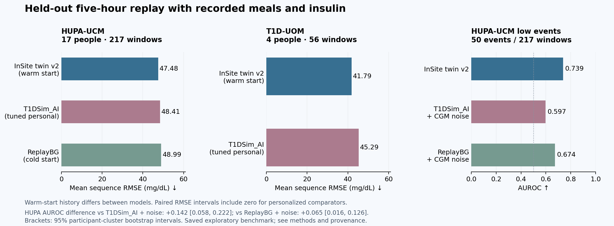

Glucose replay errors were comparable to the personalized baselines. The stronger result was **low-event discrimination on HUPA-UCM**: AUROC **0.739** for the twin, **0.597** for tuned T1DSim_AI with matched CGM noise, and **0.674** for ReplayBG with matched CGM noise. This comparison included 17 people, 217 windows, and 50 low events.

The paired AUROC advantage was **+0.142 [0.058, 0.222]** over T1DSim_AI and **+0.065 [0.016, 0.126]** over ReplayBG, using 95% participant-cluster bootstrap intervals. The twin uses a six-hour warm-up history; the comparators have different initialization procedures. These exploratory results evaluate recorded-input replay. The small UOM cohort had only seven low events.

[Evaluation protocol and full results](docs/twin-benchmark.md) · [Aggregate results and source hashes](examples/twin-benchmark-summary.json) · [Recreate the figure](scripts/plot_twin_benchmark.py)

### Interactive simulation

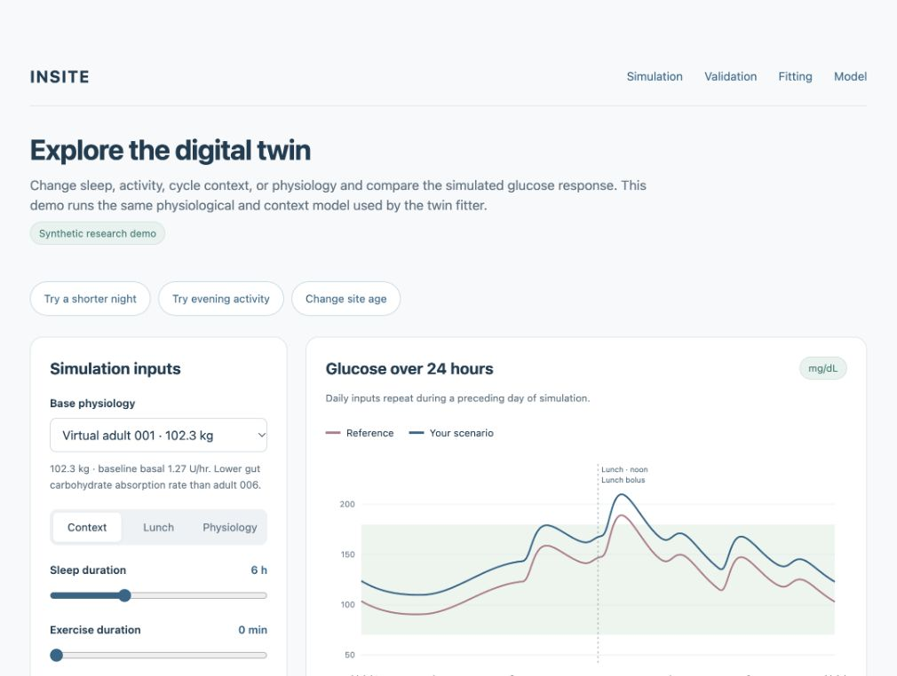

Try a shorter night, evening activity, or an older infusion site, then explore the individual inputs. The plot marks lunch, bolus timing, and exercise; outcome cards show each scenario’s difference from the reference over 24 hours. The interactive controls use the model's prior coefficients. A separate synthetic calibration example shows the fitting and held-out replay path.

```bash
python -m venv .venv
source .venv/bin/activate
pip install -r requirements.txt -r twin/requirements.txt
python demo/server.py --port 8874
```

Open **http://127.0.0.1:8874**. The **Validation** section walks through the benchmark and its saved results; **Fitting** shows the synthetic train/evaluation split and glucose curves. [Demo details](demo/README.md).

### Synthetic calibration

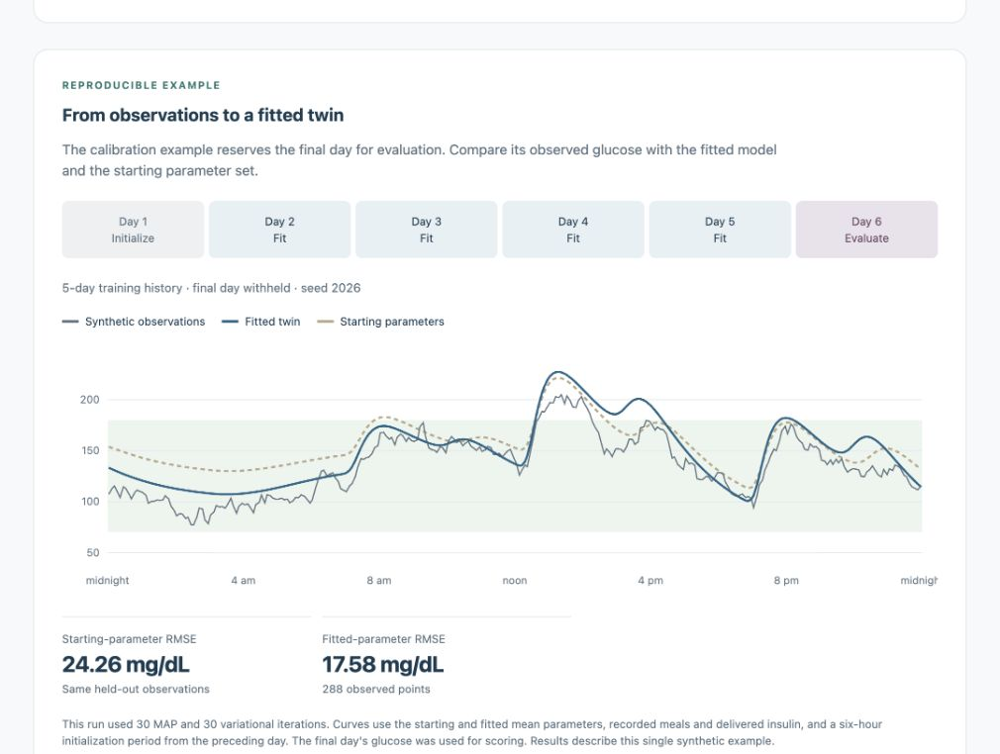

A fixed six-day example uses one initialization day, four fit-loss days, and a final held-out day. With recorded meals and delivered insulin supplied to replay, RMSE on 288 held-out glucose points changed from **24.26 mg/dL** at the starting parameters to **17.58 mg/dL** after fitting. The run used 30 MAP and 30 variational iterations; these results describe this single bounded example.

[Saved curves and run settings](examples/synthetic-calibration.json) · [Reproduce the fit](scripts/build_calibration_example.py)

### Numerical verification

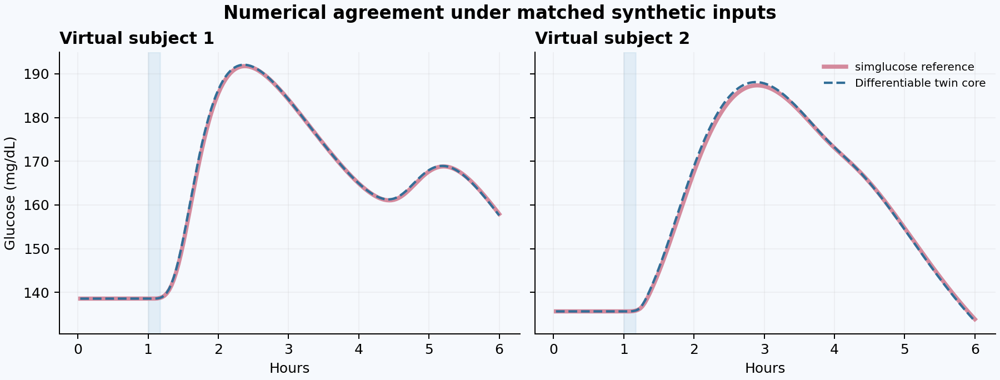

For two virtual subjects under matched six-hour inputs, the maximum difference from simglucose was **1.34 mg/dL**, with pooled numerical RMSE **0.53 mg/dL**. This evaluates implementation agreement. Personal fitting and intervention response have their own evaluation requirements, described in the [claim audit](docs/twin-claim-audit.md).

[Reproduce the figure](scripts/twin_numerical_check.py) · [Checks actually run](verification.json)

## Personal patterns

The pattern engine constructs event-aligned and daily rows from timestamped observations. Features cover preceding hours, days, and weeks. Historical subgroup search finds recurring relationships; current-context retrieval finds earlier situations similar to the present context.

Candidate findings pass chronological, coverage, support, matching, and uncertainty checks. Each released observation retains its supporting episodes. A local language model words the structured finding, and a validation step checks the claims and links against the evidence.

For example, a row anchored to a logged meal can describe the previous night's sleep, recent activity, cycle records, site age and location, glucose before the meal, and recorded carbohydrates and insulin. Its targets describe what followed: early and later glucose responses, variability, or sustained low and high episodes. The search can combine those features to identify a recurring context, then retrieve the actual days behind it.

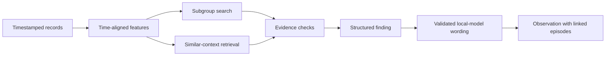

[Methods](docs/pattern-discovery.md) · [Synthetic examples](examples/README.md) · [Data and evaluation](docs/data-and-evaluation.md)

```bash
python scripts/run_demo.py quick
python -m pytest tests -q
```

The quick command exercises the pipeline on a short artificial history. `python scripts/run_demo.py full` runs the longer 120-day synthetic scenarios. The saved example includes accepted wording from an earlier offline model run; the CLI produces engine findings.

## From an observation to its evidence

These captures use synthetic data in the actual iOS app. Tapping an observation opens its evidence, including the glucose curves and recorded events for individual days.

| Observation | Supporting days | Individual episode |
| --- | --- | --- |
| 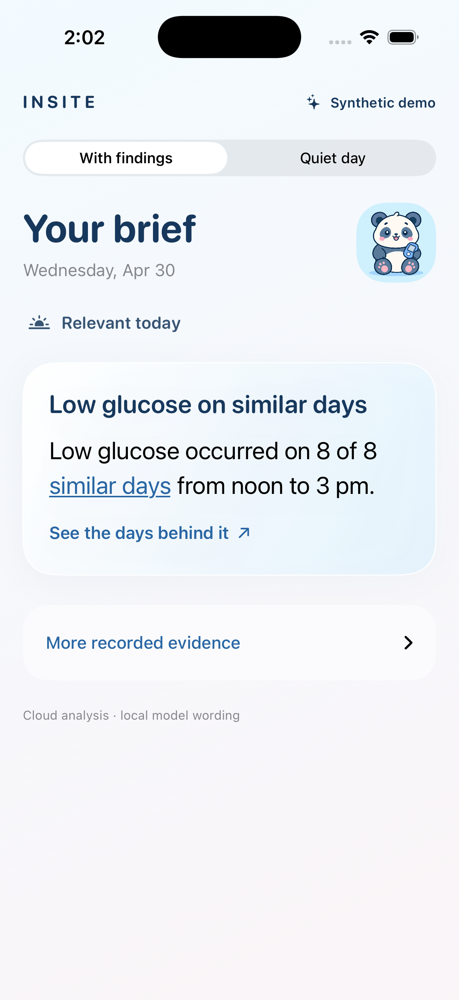 | 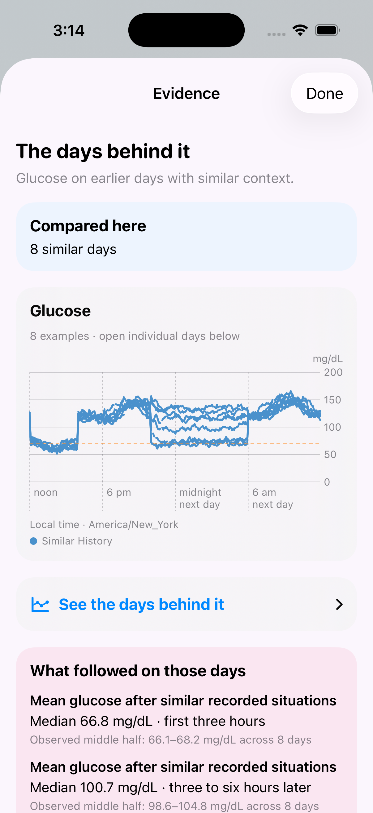 | 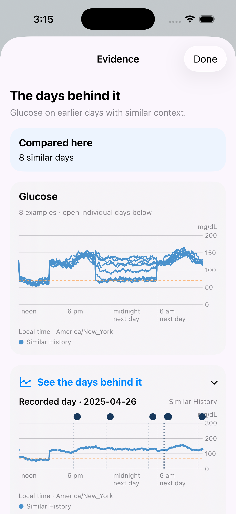 |

[App and data handling](docs/app-and-privacy.md)

## Research direction: automated insulin delivery

The next research step is an action-conditioned latent world model. It would encode recent observations and longer-term context, simulate the consequences of candidate insulin courses, and score separate low- and high-glucose costs. The actor and planner would use those consequences to choose actions, with memory carrying earlier doses and their continuing effects.

The physiological twin provides a way to study controlled interventions and variation between virtual people. The pattern engine provides interpretable observations and evidence that can help examine learned representations. Closed-loop evaluation will compare time in range, hypoglycemia, variability, and failures under matched simulator scenarios and interaction budgets.

[Architecture, evaluation plan, and current scope](docs/research-direction.md)

## Repository contents

- `src/insite_analytics/`: selected pattern-engine source.
- `twin/`: physiological model, fitter, and synthetic tests.
- `demo/`: interactive interface and local simulation server.
- `examples/`: synthetic findings and calibration outputs.
- `docs/`: methods, assumptions, evaluation, and publication scope.

[Reproducibility](docs/reproducibility.md) · [Source and licensing](NOTICE.md) · [Publication contents](PUBLICATION_CONTENTS.md)

Example records and app screenshots are synthetic. Research-dataset comparisons are shared as cohort-level aggregates. Source manifests record the copied implementation files and their hashes. The verification record distinguishes executed checks from evaluation still to be completed.
