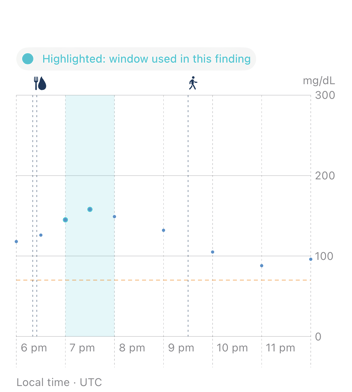

# Automatic brief delivery

The private pilot checks for eligible work hourly. After 8 a.m. in the user's
resolved timezone, it can generate one completed brief per local day and engine
revision. Each brief links to its supporting episodes in the user's protected
account. Per-user opt-in is checked before processing and again before publication.

Firestore transactions coordinate concurrent runs. Expiring leases prevent an older
worker from publishing after another worker takes over. Failed attempts have a
cooldown and a bounded retry budget. Insufficient-data checks can retry after new
history arrives without consuming that failure budget.

The pilot uses source-derived participant wording. Notifications and external AI
model calls are off. The public repository contains engine code and synthetic
examples; deployment configuration and participant histories stay in the private
application project.

## Verification on September 26, 2026

| Check | Result | Scope |
| --- | --- | --- |
| Backend lifecycle and evidence tests | 36 passed | Focused Python tests and the official local Firestore emulator |
| Native app tests | 24 passed | iOS simulator; chart parsing, rendering, and release flags |
| Availability-mode regression | Passed | Strict versus retrospective imported-history handling |
| Deployed synthetic worker | Completed, stale history reported, zero error types | Existing dated artificial history |
| Hourly schedule and entrypoint | Verified active | Private worker configuration |

The nonempty finding-to-Firestore path and evidence links were exercised with
synthetic fixtures in the local emulator. The cloud smoke test exercised the
stale-history path. These checks are recorded from the private application
workspace; the public snapshot includes the portable engine tests and their own
verification record.

The latest app changes await TestFlight upload and physical-phone verification.
The release checks above establish software behavior on synthetic inputs.
Clinical usefulness and reliability on participant histories require their own
prospective evaluation.

## Evidence highlighting

The engine emits exact outcome boundaries. The app shades that interval and colors
its measured points, while retaining gaps and surrounding context. The chart below
uses a synthetic native test fixture.

