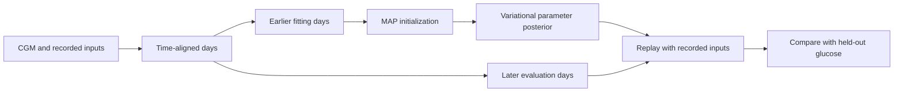

# The physiological twin

The twin is a Python research library for fitting a differentiable glucose simulator to time-aligned CGM, insulin-delivery, meal, and optional context records. This portfolio includes a selected snapshot of that library, its synthetic tests, and a small recovery script. It does not include participant records or fitted participant models.

The simulator starts from an adult virtual subject in `simglucose`. It adjusts physiological quantities such as insulin sensitivity, glucose production, and insulin and carbohydrate absorption. It can also fit context effects, day-to-day drift, meal count and timing error, personal response corrections, and a residual disturbance for effects the recorded inputs do not explain. Therapy settings and physiology are represented separately in the model ([parameters](../twin/t1d_twin/params.py), [fitting](../twin/t1d_twin/fit.py), [rollout](../twin/t1d_twin/model.py)).

Fitting first finds a maximum-a-posteriori starting point, then estimates a posterior over shared physiological parameters and simpler day- and event-level quantities. When `holdout_days` is set, the fitter reserves the trailing days and computes replay diagnostics for them; a zero value disables that split ([fit configuration and split](../twin/t1d_twin/fit.py)). The held-out calculation uses recorded inputs and is therefore a replay check. It is not a prospective forecast with unknown future meals or insulin.

The code treats missing delivery differently from an observed zero. Days without enough insulin-delivery information can be skipped instead of filled from a scheduled basal value. The timeline also handles irregular day lengths and multiple input cadences ([data handling](../twin/t1d_twin/data.py), [tests](../twin/tests/test_twin.py)).

## From records to a personal model



| Part | What it represents | Where to inspect it |
| --- | --- | --- |
| Core physiology | Glucose production, insulin sensitivity and action, insulin and meal absorption | [Parameters](../twin/t1d_twin/params.py) |
| Context | Sleep, activity, cycle, site age, stress, and time-of-day effects | [Input-to-mechanism map](twin-capabilities.md) |
| Fitting | Shared physiology, day/event variation, and uncertainty from earlier records | [Fitter](../twin/t1d_twin/fit.py) |
| Evaluation | Glucose replay error and sustained low-event discrimination on reserved windows | [Benchmark protocol](twin-benchmark.md) |

## Interactive model and calibration

The [interactive demo](../demo/README.md) uses the full context and physiology rollout over a preceding day and the displayed 24 hours. Its controls expose sleep, exercise, cycle day, site age, stress, lunch inputs, and selected core physiological multipliers. The [capability table](twin-capabilities.md) maps each recorded input to its model mechanism.

The separate [calibration script](../scripts/build_calibration_example.py) generates synthetic observations, fits an earlier chronological segment, and replays the final day with held-out glucose reserved for scoring. The saved JSON records the optimization budget, parameter sources, and results. This evaluates one reproducible example under known recorded inputs.

## Comparison with other digital twins

The saved benchmark compares this physiological twin with T1DSim_AI on HUPA-UCM and T1D-UOM and with ReplayBG on HUPA-UCM. It finds comparable glucose errors and a stronger HUPA low-event discrimination result under recorded-input replay. The [benchmark methods and results](twin-benchmark.md) include cohort sizes, paired intervals, input conditioning, and initialization differences.

## What the implementation checks show

The numerical check runs the differentiable ODE and the `simglucose` reference under matched six-hour synthetic inputs for two published virtual subjects. The maximum pointwise difference is 1.34 mg/dL and pooled RMSE is 0.53 mg/dL. This is evidence that the two implementations agree for this limited numerical check. It does not validate fitted-person forecasts or treatment effects ([figure and reproduction script](../assets/twin-numerical-check.png), [script](../scripts/twin_numerical_check.py)).

The snapshot also ran five focused synthetic checks: simulator agreement, fit serialization with held-out diagnostics, direction of a paired insulin experiment, exclusion of scheduled basal across delivery gaps, and the distinction between explicit zero delivery and unknown delivery. These checks exercise implementation contracts; they do not measure performance on people.

For a small synthetic fitting run, install the twin dependencies and run from the portfolio root:

```bash
PYTHONPATH=src:twin python twin/scripts/twin_recovery.py \
  --people 1 --days 4 --holdout 1 --map-iters 3 --iters 3 \
  --samples 2 --base truth --no-aid \
  --out /tmp/twin-recovery-smoke.json
```

This deliberately short run checks that the fitting and recovery path executes. Three optimization steps are a smoke check, not a converged fit. The script generates its own artificial records ([source](../twin/scripts/twin_recovery.py)).

## What remains open

Glucose traces and logged inputs may support several physiological explanations at once. An unlogged meal, an inaccurate carbohydrate count, variable insulin absorption, and a model disturbance can produce similar residual patterns. A good fit to observed glucose does not show that each fitted parameter has a unique physiological interpretation.

The delivery experiment scales recorded meal boluses, corrections, and basal, then reruns the simulator with the same posterior draws and scenario across arms. That makes paired comparisons useful for studying what the model implies. It does not establish that a real person would have the simulated response. For closed-loop systems, replaying scaled delivery omits how the controller would react ([experiment code](../twin/t1d_twin/experiment.py)). I do not treat these outputs as treatment recommendations.

The app-v1 interface and its fitting/data service are separate from this library and are not included in this portfolio snapshot. The library and synthetic demo should not be read as a description of a deployed service or as evidence that the app makes or applies therapy changes.
