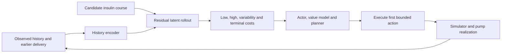

# Research direction: personalized automated insulin delivery

The long-term goal is a world model that preserves the information an actor needs to choose insulin actions with good long-term consequences. Insulin has delayed effects, so the state must carry earlier delivery, recent physiology, and longer history through each planning step.

## The current JEPA research prototype

The separate `ChameliaT1D/t1d_world/jepa_world_model.py` implementation contains:

- **An any-variate patch encoder.** Each token contains one channel's measurements within a one-hour frame, their validity mask, and time information. A shared patch MLP and channel identifiers feed the attention layers. The current channel registry contains CGM and delivered dose; additional physiological channels are a development direction.
- **A slot representation.** Sixteen learned slots preserve multiple aspects of the state. Default history spans four hourly frames.
- **An action-conditioned residual predictor.** Each step carries the previous latent forward and learns a change conditioned on the next dose frame and noise. Zero-initialized AdaLN gates begin at persistence, making learned action sensitivity measurable.
- **Per-frame outcome heads.** Separate nonnegative cost outputs and termination logits allow different consequences to remain inspectable across the imagined trajectory.

The design trains rolled predictions against encoded future observations, uses representation regularization to discourage collapse, and supervises outcome decodability. Four hourly rollout frames are the current default. The experimental goal-conditioned planner compares predicted states with a goal embedding and includes a termination-risk term. Earlier `integrated_model.py` and `integrated_agent.py` prototypes also contain a sequence actor, value models, multiscale history, and episode/procedure memory. These are distinct experimental paths in the working research repository.

## Where the app, patterns, and twin contribute

| Component | Role in the research |
| --- | --- |
| App | Collect time-aligned observations, actual insulin delivery, source provenance, and contextual logs. |
| Pattern engine | Expose recurring contexts and supporting episodes; help formulate interpretable tests of learned representations. |
| Physiological twin | Generate controlled synthetic trajectories and study how candidate interventions behave across physiology and uncertainty. |
| Latent world model | Learn compact dynamics for repeated evaluation of candidate action courses. |

A candidate integrated planning loop is:

The design question is whether learned trajectories preserve action consequences accurately enough for planning. The twin's held-out replay results help assess physiological modeling; controlled intervention tests and closed-loop rollouts address the next questions.

## Evaluation priorities

1. Compare predicted latents and decoded outcomes with actual future states across multiple horizons, including persistence baselines.
2. Change candidate dose courses and measure whether predicted consequences respond correctly; test delayed credit assignment and earlier insulin exposure.
3. Evaluate on held-out virtual people, scenarios, and random seeds. Freeze selection and evaluation protocols.
4. Compare controllers under matched interaction budgets and simulator conditions, reporting time in range, low and severe-low exposure, high glucose, variability, and failures separately.
5. Check action units, pump realization, memory provenance, missing inputs, and uncertainty before connecting the full action interface.

The active work is simulator research. Participant-facing InSite remains a data-collection pilot with pattern cards disabled. The next releases can present observational findings and their evidence while the controller research is evaluated separately.

Working-source references: `ChameliaT1D/JEPA_WORLD_MODEL_DESIGN.md`, `ChameliaT1D/t1d_world/jepa_world_model.py`, `ChameliaT1D/ACTION_CONTRACT_REVIEW.md`, and `ChameliaT1D/G2P2C_EVALUATION_PROTOCOL.md`. The AID code remains in the working repository; this snapshot contains the app presentation, pattern engine, and physiological twin.
